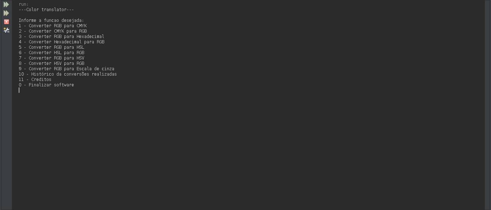
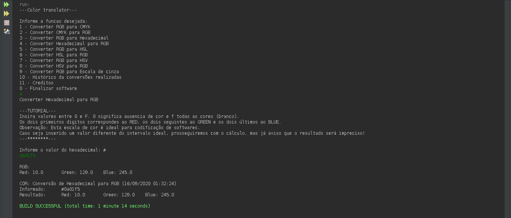
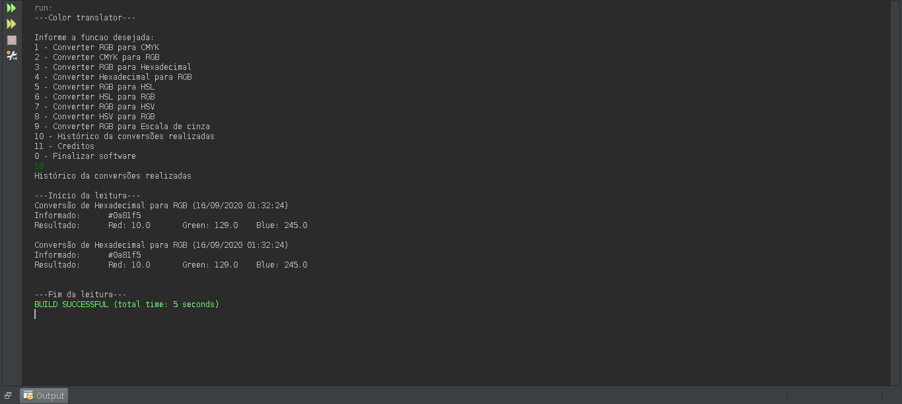

# Color translator
Software de conversão de sistema de cores.

# Informações essenciais
- Idioma: Português.
- Linguagem: Java.
- Não contêm interface gráfica.
- Funciona em ambientes: Linux, MacOS e Windows.
- Recomendação: Execute pelo NetBeans.

# Funcionalidades
- [x] RGB - CMYK.
- [x] CMYK - RGB.
- [x] RGB - HEXADECIMAL.
- [x] HEXADECIMAL-RGB.
- [x] RGB - HSL.
- [x] HSL - RGB.
- [x] RGB - HSV.
- [x] HSV - RGB.
- [x] RGB - RGB (escala de cinza).
- [x] Verificação para validação de um intervalo limite dos valores de cores inseridos.
- [x] Histórico de conversões (juntamente com a data).

# Screenshoots

## Menu

## Resultados

